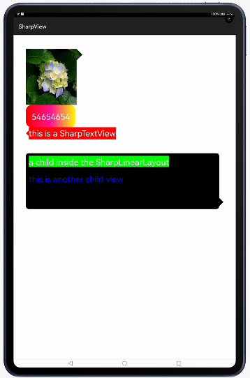

# SharpView

custom TextView,LinearLayout,RelativeLayout with sharp

## Screenshots



## Directions

* custom properties

name | format | instructions
-----|------|----
radius    | dimension    | 圆角大小
backgroundColor   | color     | 背景颜色（注意不要是用安卓原生的背景相关的属性（如:background,backgroundResource等））
arrowDirection    | enum    | 尖叫汽包相对位置(top,left,right,bottom)
relativePosition   | fraction| 尖叫汽包相对位置，百分比
sharpSize    | dimension    | 尖叫汽包大小，为0表示不显示尖角，默认是0
border    | dimension    | 边框大小，默认是0
borderColor    | color    | 边框颜色
startBgColor    | color    | 渐变初始颜色(渐变时必选)
middleBgColor    | color    | 渐变中间颜色(渐变时可选)
endBgColor    | color    | 渐变结束颜色(渐变时必选)

渐变颜色只有在sharpSize为0时（没有尖角）有效

## Usage

* 1.In the XML
```java

  <com.zhaoxing.view.sharpview.SharpEditText
        ohos:width="match_content"
        ohos:height="match_content"
        ohos:left_margin="50vp"
        ohos:text_color="#FFFFFF"
        ohos:text="this is a SharpTextView"
        ohos:text_size="30vp"
        app:backgroundColor="#FFFF0000"
        app:arrowDirection="left"
        app:relativePosition="0.5"
        app:sharpSize="10vp"
        />
   
  <com.zhaoxing.view.sharpview.SharpLinearLayout
        ohos:width="700vp"
        ohos:height="200vp"
        ohos:orientation="vertical"
        ohos:margin="50vp"
        app:radius="10vp"
        app:arrowDirection="right"
        app:backgroundColor="#FF000000"
        app:relativePosition="0.9"
        app:sharpSize="15vp">

    </com.zhaoxing.view.sharpview.SharpLinearLayout>


```

* 2.In the code
```java

SharpLinearLayout sharpLinearLayout = (SharpLinearLayout) findViewById(ResourceTable.Id_sharp_ll);
//get the SharpViewRenderProxy of the sharpView to refresh sharp）
sharpLinearLayout.getRenderProxy().setArrowDirection(SharpView.ArrowDirection.BOTTOM);
sharpLinearLayout.getRenderProxy().setSharpSize(50);
sharpLinearLayout.getRenderProxy().setRelativePosition(0.8f);
sharpLinearLayout.getRenderProxy().setRadius(20);
sharpLinearLayout.getRenderProxy().setBackgroundColor(0xff000000);//注意不要使用安卓原生的设置背景的相关方法（如setBackground，setBackgroundResource等）

```


## Usage
目前支持的气泡尖角或圆角控件和安卓原生控件继承关系如下
```java
public class SharpEditText extends TextField
public class SharpTextView extends Text 
public class SharpLinearLayout extends DirectionalLayout
public class SharpRelativeLayout extends DependentLayout 
public class SharpImageView extends Image 
```
# Author 
name ： 曾宪梓<br/>
email ： 1071481464@qq.com

# License

Copyright 2017 zengzhaoxing


Licensed under the Apache License, Version 2.0 (the "License");
you may not use this file except in compliance with the License.
You may obtain a copy of the License at

   http://www.apache.org/licenses/LICENSE-2.0

Unless required by applicable law or agreed to in writing, software
distributed under the License is distributed on an "AS IS" BASIS,
WITHOUT WARRANTIES OR CONDITIONS OF ANY KIND, either express or implied.
See the License for the specific language governing permissions and
limitations under the License.
